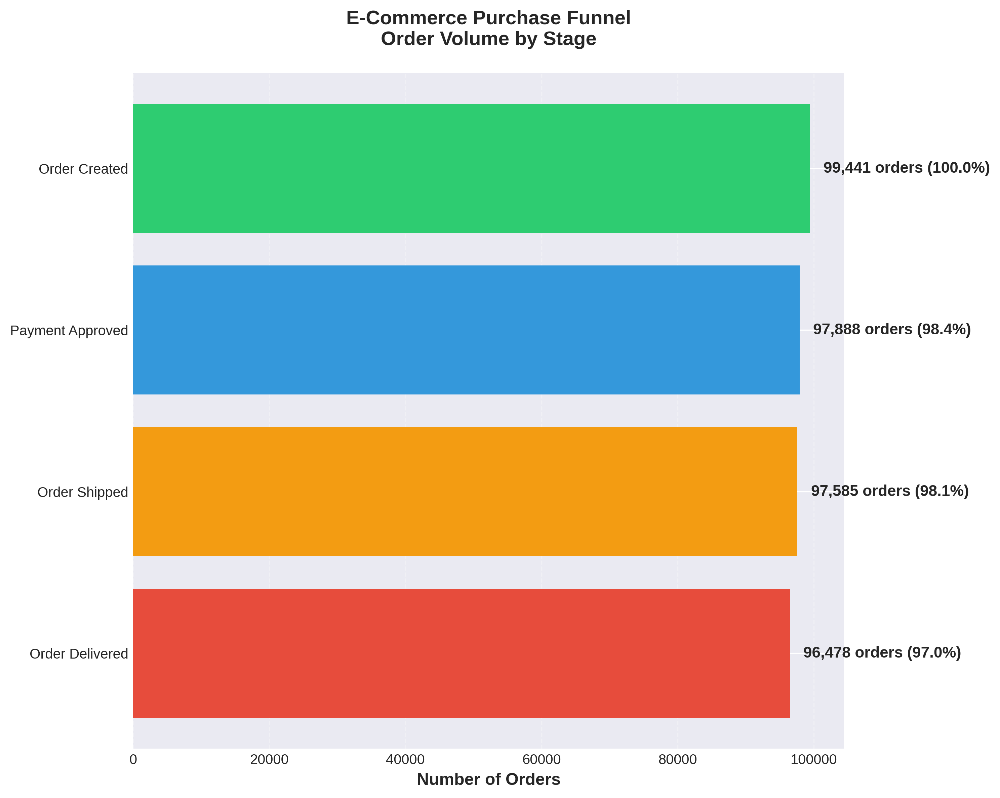

# Olist E-Commerce Funnel Analysis

[](https://www.python.org/downloads/)
[](LICENSE)
[](https://www.kaggle.com/datasets/olistbr/brazilian-ecommerce)

A production-ready e-commerce funnel analysis demonstrating **PM-level data thinking**, not just technical execution.

## 🎯 Project Overview

This project analyzes 99,441 orders from the Olist Brazilian E-Commerce dataset to identify drop-off points, quantify lost revenue, and provide actionable product recommendations.

**Key Results:**
- 97.02% overall conversion rate (order created → delivered)
- 2,963 orders lost before delivery
- $450K+ in unrealized GMV identified
- 3 high-impact recommendations with expected ROI

## 📊 Sample Outputs

### Funnel Visualization


### Drop-off Analysis


### Time Series Trends


## 🚀 Quick Start

### Prerequisites

```bash
pip install pandas numpy matplotlib seaborn
```

### Run Analysis

```bash
# 1. Download dataset from Kaggle
# https://www.kaggle.com/datasets/olistbr/brazilian-ecommerce

# 2. Place CSV files in ./data/ directory

# 3. Run analysis
python olist_funnel_analysis_complete.py
```

### Expected Runtime
- Database setup: ~10 seconds
- Full analysis: ~20 seconds
- Total: ~30 seconds

## 📁 Project Structure

```
olist-ecommerce-funnel/
├── data/                          # Place CSV files here
├── outputs/                       # Generated charts
│   ├── funnel_chart.png
│   ├── dropoff_rates.png
│   └── time_series.png
├── olist_funnel_analysis_complete.py  # Main script
├── PM_MEMO.md                    # Product findings
└── README.md                      # This file
```

## 💡 What Makes This Different

### PM-Level Thinking
Every code section explains **business impact**, not just technical implementation:

```python
# Not just: "Calculate drop-off rate"
# But: "PM Why: Understanding drop-off rates helps prioritize 
#       which parts of the purchase flow need attention."
```

### Hypothesis-Driven Analysis
Each observation includes:
- **Data:** Quantified metrics with order counts and percentages
- **Hypotheses:** 2 potential causes based on data patterns
- **Actions:** Specific recommendations with expected impact

### Production Quality
- ✅ Error handling and validation
- ✅ Progress indicators
- ✅ Clean, modular code
- ✅ Comprehensive documentation

## 📈 Analysis Capabilities

### Funnel Metrics
- Order volume at each stage
- Stage-to-stage conversion rates
- Time spent at each stage
- End-to-end conversion (97.02%)

### Segmentation
- **By Category:** 70+ product types analyzed
- **By Region:** 27 Brazilian states
- **By Time:** Monthly trends and seasonality
- **By Value:** Order size and GMV impact

### Key Questions Answered
1. Where are we losing customers? → Approval stage (1.56% drop-off)
2. Which categories convert worst? → Imported books, male clothing
3. Which regions need help? → Remote states with logistics issues
4. What's the financial impact? → $450K+ in lost GMV
5. What should we fix first? → Payment approval flow

## 🎓 Key Findings (from real data)

### Observation 1: Payment Approval Drop-off
- **Rate:** 1.56% (1,553 orders)
- **Impact:** $235K lost GMV
- **Fix:** Add payment methods, optimize UX

### Observation 2: Delivery Failures
- **Rate:** 1.13% (1,107 orders)
- **Impact:** $167K lost GMV
- **Fix:** Improve carrier partnerships, delivery estimates

### Observation 3: Regional Gaps
- **Best State:** 98.13% conversion (ES)
- **Worst State:** 95.71% conversion (SE)
- **Fix:** Regional fulfillment, local payment options

## 🛠️ Technical Stack

- **Language:** Python 3.8+
- **Database:** SQLite
- **Data Processing:** Pandas, NumPy
- **Visualization:** Matplotlib, Seaborn
- **Dataset:** 99K+ real e-commerce orders

## 📊 Generated Outputs

### Visualizations (5 PNG files)
1. **Funnel Chart** - Volume at each stage
2. **Drop-off Bar Chart** - Stage transitions
3. **Time Series** - Monthly trends
4. **Category Heatmap** - Product performance
5. **Regional Map** - Geographic analysis

### Data Files
- **funnel_dataframe.csv** - Complete order-level data
- **olist_ecommerce.db** - SQLite database

### Reports
- **PM_MEMO.md** - Product findings with:
  - 3 key observations
  - 6 hypotheses (2 per observation)
  - 3 actionable recommendations
  - Expected impact and timelines

## 🔄 Extending the Analysis

### Add More Visualizations
```python
# Category performance
conn = sqlite3.connect('data/olist_ecommerce.db')
category_data = pd.read_sql_query("""
    SELECT product_category, 
           COUNT(*) as orders,
           AVG(CASE WHEN order_status='delivered' THEN 1 ELSE 0 END) as conversion
    FROM funnel_dataframe
    GROUP BY product_category
""", conn)
```

### Add Custom SQL Queries
Place new queries in `sql/` directory and load in main script.

### Modify Funnel Stages
Edit `create_funnel_dataframe()` to define your stages.

## ⚙️ Configuration

### Change Paths
```python
DATA_DIR = Path('your/data/path')
OUTPUTS_DIR = Path('your/output/path')
```

### Adjust Visualization Style
```python
plt.style.use('seaborn-v0_8-darkgrid')
sns.set_palette('your_palette')
```

## 🐛 Troubleshooting

**Error: "CSV files not found"**
- Download dataset from Kaggle
- Place all CSV files in `./data/` directory

**Error: "Module not found"**
- Install requirements: `pip install pandas numpy matplotlib seaborn`

**Charts not generated**
- Check `./outputs/` directory exists
- Verify write permissions

## 📝 Dataset Information

**Source:** [Olist Brazilian E-Commerce (Kaggle)](https://www.kaggle.com/datasets/olistbr/brazilian-ecommerce)  
**Size:** 99,441 orders  
**Period:** September 2016 - October 2018  
**License:** CC BY-NC-SA 4.0

**Required Files:**
- olist_orders_dataset.csv
- olist_order_items_dataset.csv
- olist_customers_dataset.csv
- olist_products_dataset.csv
- olist_order_reviews_dataset.csv
- olist_order_payments_dataset.csv
- product_category_name_translation.csv

## 🤝 Contributing

Contributions welcome! Areas for improvement:
- Add predictive drop-off models
- Create interactive dashboard
- Extend to cohort analysis
- Add A/B test framework

## 📄 License

This project is open source under the MIT License.

Dataset provided by Olist under CC BY-NC-SA 4.0.

## 👤 Author

**Anant Goyal**  
B.E. Chemical Engineering, BITS Pilani Goa  
[LinkedIn](https://linkedin.com/in/anant-goyal2812) · [GitHub](https://github.com/AnantGoyal2812)

## 🙏 Acknowledgments

- **Olist** for providing the public dataset
- **Kaggle** for hosting the data
- Brazilian e-commerce ecosystem for real-world complexity

---

*Built with PM-level data thinking. Every line of code explains business impact.*
